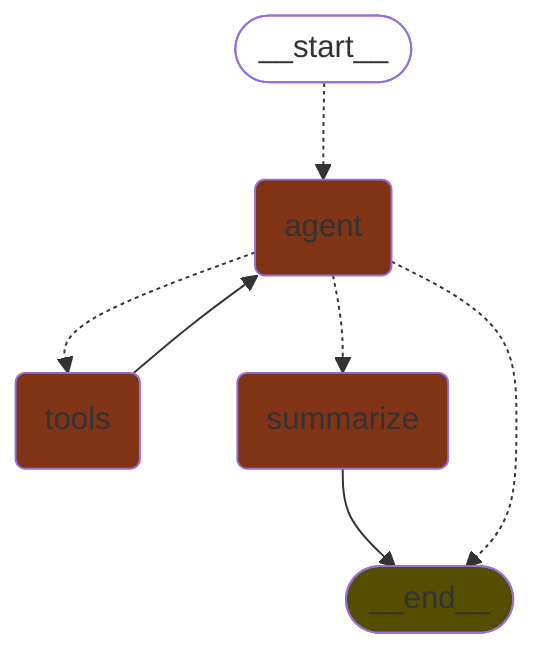

# Course 5 - Personalized Real Estate Agent (HomeMatch)

## Introduction

This project aims to create a personalized real estate agent using AI for "Future Homes Realty", a forward-thinking real estate company. The project involves building a system that can understand user preferences, search for suitable properties, and provide recommendations based on those preferences.

## Environment Setup

### Create Micromamba Environment

1. **Create a micromamba environment using the `environment.yml` file**:
   ```sh
   micromamba create -f environment.yml
   ```

2. **Activate the `langchain` environment**:
   ```sh
   micromamba activate langchain
   ```

### Create Python Virtual Environment

1. **Create a Python virtual environment called `pystack`**:
   ```sh
   python -m venv pystack
   ```

2. **Activate the virtual environment**:
   - On Windows:
     ```sh
     pystack\Scripts\activate
     ```
   - On macOS and Linux:
     ```sh
     source pystack/bin/activate
     ```

3. **Install requirements from `requirements.txt`**:
   ```sh
   pip install -r requirements.txt
   ```

### Explanation

Having a virtual environment (venv) inside a micromamba environment helps to isolate Python packages from the main development environment. This approach overcomes the limitations of incompatible packages usually found in the `conda-forge` channel. By using both environments, we can ensure that the project dependencies are managed effectively and conflicts are minimized with system wide packages.

## Generating Fake Property Listings

### Using `create-listings.py`

The script `create-listings.py` is designed to generate a CSV file containing fake property listings. Here's how to use it:

1. **Navigate to the project directory**:
   ```sh
   cd /path/to/Course5.4-project-real-state-agent
   ```

2. **Run the script**:
   ```sh
   python create-listings.py --num_properties 100 --output_path ./data/properties.csv --append
   ```

### Explanation

- **`--num_properties`**: Specifies the number of properties to generate. Default is 100.
- **`--output_path`**: Specifies the path to save the generated properties. Default is `./data/properties.csv`.
- **`--append`**: If this flag is set, the script will append to the existing file. If not, it will overwrite the file.

The script uses the OpenAI language model to generate property listings based on predefined formats and descriptions. The generated listings are then saved to a CSV file.

### Example Output

The generated CSV file (`properties.csv`) will contain columns such as `neighborhood`, `price`, `bedrooms`, `bathrooms`, `sqft`, `description`, and `neighborhood_desc`. Here is a sample of the output:

```csv
neighborhood,price,bedrooms,bathrooms,sqft,description,neighborhood_desc
Midtown,500000.0,2,2,1500,"Beautiful contemporary style condo in the heart of Midtown. Only 5 years old, this property features an open floor plan, high ceilings, and modern finishes throughout.","Midtown is a vibrant and bustling neighborhood with a mix of restaurants, bars, and shops. It is also conveniently located near public transportation and major highways."
Buckhead,750000.0,3,3,2500,"Stunning single-family home in the upscale neighborhood of Buckhead. This property offers a traditional design with a contemporary twist, including a gourmet kitchen and spacious master suite.","Buckhead is known for its luxurious homes, upscale shopping, and fine dining options. It is also home to several prestigious private schools and is a popular choice for families."
...
```

## Building the Real Estate Agent

To build the real state agent, we can start taking incremental steps:

- Creating the vector store and add the property listing embeddings.
- Define the main aspects of the agent and familiarize with the LangChain & LangGraph framework.
- Create the Agent graph using LangGraph.
- Build a testing loop start interacting with the Agent.
- Improve and refine the prompts and the control logic of the Agent until we get the desired behavior.

### The vector store and the record manager


### LangGraph and the Agent graph

